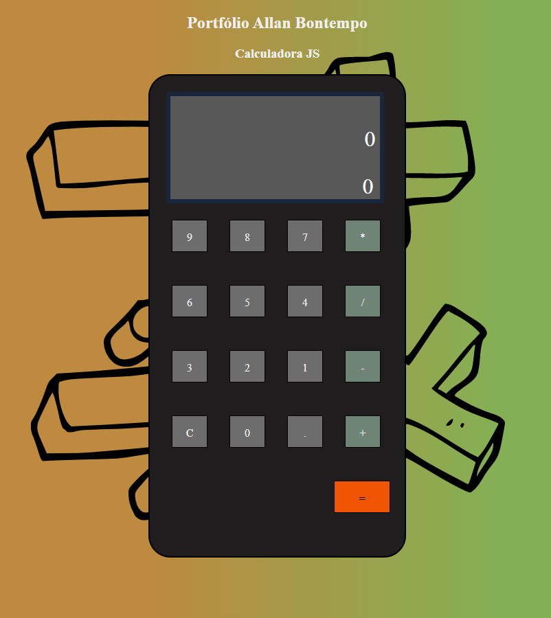

# CalculadoraJS

These days I'm working with a lot of frameworks, but I decided to go back to JS Vanilla and play around a bit.

A simple project, but it was a lot of fun to make the classic, that is a calculator!

  

